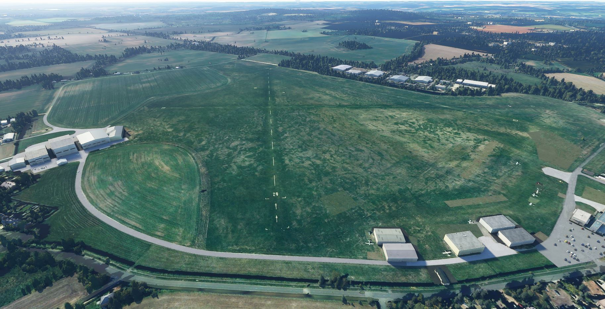

# EGLM (White Waltham Airfield) Tree Fix
#### Author: Julysfire
Discord: julysfire#9465        MSFS2020: blackflame0729

##### Description
Fixes all the trees spawning in the airfield in MSFS 2020.   Per satellite imgary imagery, there should not be any trees on the airfield.  This lightweight addon removes the trees.

#### ---Installation Instructions---
1. Download the .zip file from Releases (or zip file here)
2. Extract files to the your Microsoft Flight Simulator Community Folder

For the Microsoft Store edition AND/OR Gamepass edition:

	C:\Users\[YOUR USERNAME]\AppData\Local\Packages\Microsoft.FlightSimulator_<RANDOMLETTERS>\LocalCache\Packages\Community
	
For the Steam edition:

	C:\Users\[YOUR USERNAME]\AppData\Roaming\Microsoft Flight Simulator\Packages\Community

#### Screenshots

	